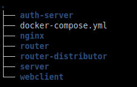

# docker-digitalstage

This repository is for running digital-stage (https://github.com/digital-stage) with docker containers. 

## For contributors

You shouldn't use the images inside this repository because the images are build with a git clone from the master branch, so you will always have a copy from the master branch only. Therefore only the docker-compose.yml is interesting for developers.

Each repository at https://github.com/digital-stage has its own Dockerfile.  

If you want to contribute/develop, first clone the repositories at https://github.com/digital-stage.
After that take the docker-compose and the nginx folder from this repository and put it inside your folder where you cloned the repositories.  

Your structure should look like this:

Building all images:  
`docker-compose build`

OR: Building a single image  
`docker-compose build <name>`  
e.g. `docker-compose build server`

Running:
`docker-compose up -d`

The main entrypoint for the application is the web ui at localhost:8080
If you start the application for the first there won't be any user added. You could create an user via the web app at 

http://localhost:8080

OR via a POST request:  

    curl -X POST -H "Content-Type: application/json" -d '{"name":"testuser","email":"test@test.tld","password":"Testtest@123"}' http://localhost:8080/auth/signup

The database is mounted in ./data. 
The router needs credentials to register himself to the router-distributor. The router takes this from the env variables `EMAIL` and `PASSWORD`. These must match with the credentials you created before.

After that the router needs to be restarted with `docker-compose restart router`, if you just added the credentials recently. 
To verify that a route was added either check the container logs or call 

    GET http://localhost:8080/routerdist/routers

The response should be a non empty array!

## TODO

- The containers are build for dev purposes. These are not production ready containers.
- Change the docker build so that it won't clone each repository. Instead take the prebuild binaries.
- Add ipv6 for the containers. The router uses ipv6, which is disabled inside the containers. (ipv6 must be enabled in the docker daemon for usage).

